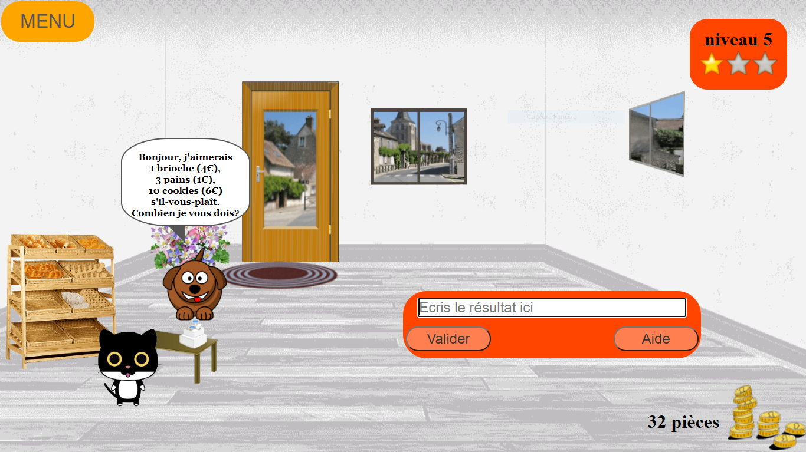

Malheureusement, les pages GitHub ne prennent en charge que les pages statiques. Il n'y a aucun moyen de lui faire exécuter du code côté serveur
# My_Bakery
 
 
 
 ###Presentation du jeu
 Quelques lignes de présentation pour savoir de quoi parle le jeu et donner envie.
 
 ###Liens
 
 - Pour jouer : **[Jeu en ligne](https://edelhomelle.github.io/My_Bakery)**
 - [Documentation](http://madocumentation/)
 - [Code source](https://github.com/edelhomelle/My_Bakery)
 
 ###Licence
 
 Le code est sous licence libre  [GNU GPL v3](https://github.com/edelhomelle/My_Bakery/blob/master/LICENSE)
 En l'état du projet, toutes les ressources multimédia ne sont pas libres, ce qui peut rendre problématique sa distribution.
 Voir [les crédits](http://mapagedecredits) pour plus de détails.